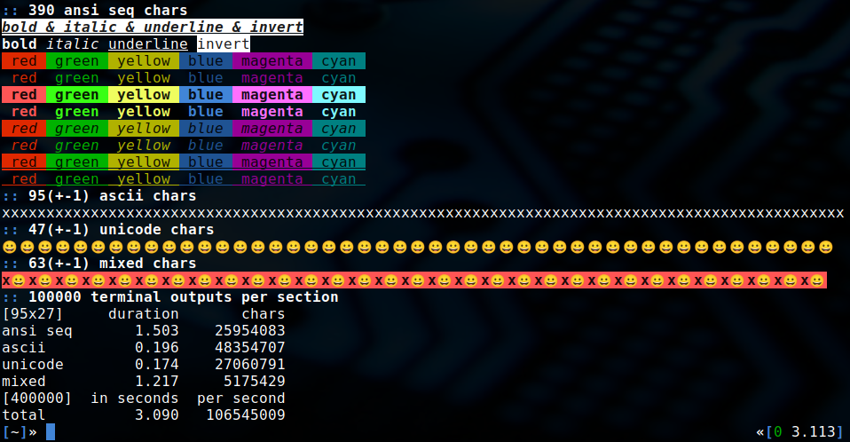
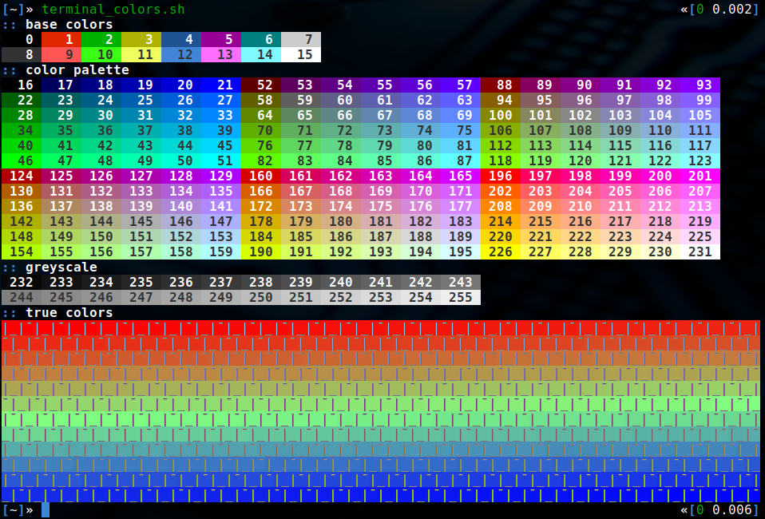

# terminal-analysis

shell scripts to analyze the terminal

| file                  | comment                                                                |
| :-------------------- | :--------------------------------------------------------------------- |
| terminal_benchmark.sh | simple benchmark for analyzing the redraw capabilities of the terminal |
| terminal_colors.sh    | script to show base colors, color palette, greyscale and true colors   |

